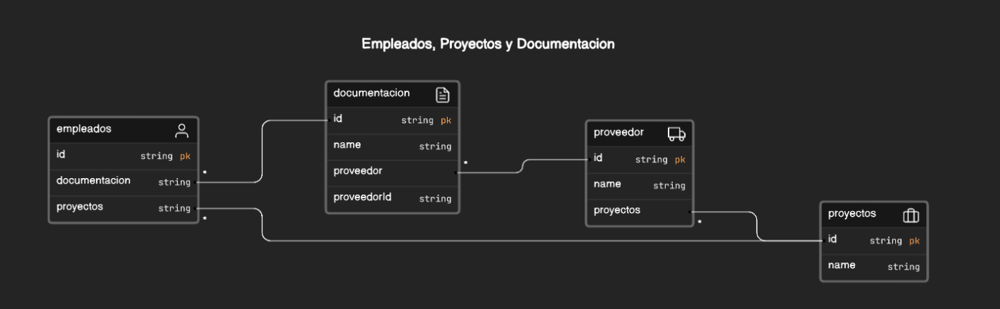
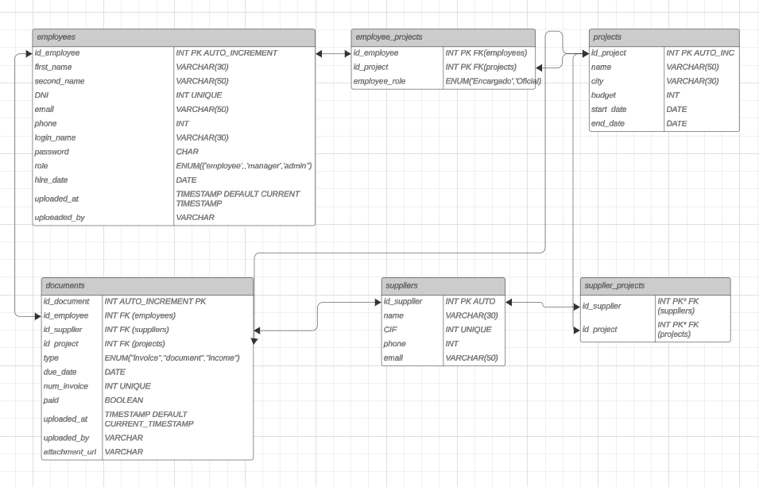

## Información diseño BD

### Nombres de las tablas

1.  Users/Employees (los úniremos y le ponemos un flag por si en el futuro queremos darles acceso al resto de empleados)
2. Documents ( utilizaremos un campo para crear un link de ruta al archivo),
documento podrá tener clave ajena, podría ser empleado, proyecto,proveedor
empleados tiene relación con proyectos y documentacion, documentación con proveedor y proveedor con proyectos
Creamos en documentos una tabla con muchos campos que no sean obligatorios y con un select que decida el tipo de documentación que vamos a introducir. Y así después filtrar
3. Projects
4. Suppliers

#### Diagrama básico

### Info tablas

#### - employees

- __id_employee__ INT / PRIMARY KEY // AUTO_INCREMENT
- __first_name__    VARCHAR(30)
- __second_name__ VARCHAR(30)
- __DNI__   VARCHAR(30) UNIQUE
- __email__ VARCHAR(50)
- __phone__ INT
- __login_name__ VARCHAR(30) UNIQUE
- __password__ VARCHAR(50)
- __role__ ENUM ("employee","manager","admin")
- __hire_date__ DATE
- __uploaded_at__ TIMESTAMP - DEFAULT - CURRENT TIMESTAMP
- __uploaded_by__ VARCHAR(30)

#### - documents

- __id_document__ INT AUTO_INCREMENT PRIMARY KEY
- __id_employee__ INT FOREIGN KEY(employees)
- __id_supplier__ INT FOREIGN KEY (suppliers)
- __id_project__ INT FOREIGN KEY (projects)
- __type__ ENUM("invoice","document","income")
- __due_date__ DATE
- __num_invoice__ INT UNIQUE
- __paid__ BOOLEAN
- __uploaded_at__ TIMESTAMP DEFAULT CURRENT TIMESTAMP
- __uploaded_by__ VARCHAR
- __attachment_url__ VARCHAR(100)

#### - suppliers

- __id_supplier__ INT PRIMARY KEY AUTO_INCREMENT
- __name__ VARCHAR(30)
- __CIF__ VARCHAR(15) UNIQUE
- __phone__ INT
- __email__ VARCHAR(50)

#### - projects

- __id_project__ INT PK AUTO_INCREMENT
- __name__ VARCHAR(50)
- __city__ VARCHAR (30)
- __budget__ INT
- __start_date__ DATE
- __end_date__ DATE

#### - employee_projects

- __id_employee__ INT PRIMARY KEY - FK (employees)
- __id_project__ INT PRIMARY KEY - FK (projects)
- __employee_role__ ENUM("Encargado","Oficial","Tecnico")

#### supplier_projects

- __id_supplier__ INT PRIMARY KEY - FK(suppliers)
- __id_project__ INT PRIMARY KEY - FK(projects)

