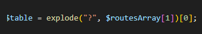
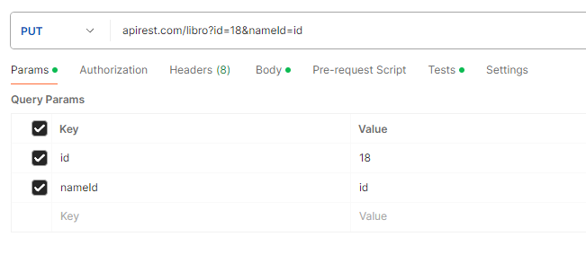
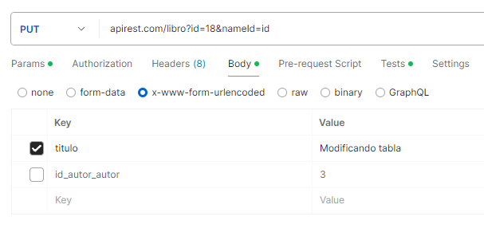

## Base de datos

#### 1.  El nombre de la tabla debe estar en plural, y los nombres de las columnas en singular.

__tabla__ users
__columnas__ id_user / name_user / pass_user

#### 2.  Al final de cada tabla hay que poner la fecha de creación y fecha de actualización.

date_created_user // date_updated_user

#### 3.  Para relacionar tablas, el ID de la tabla relacionada debe estar en una columna de nuestra tabla principal.

Tabla principal __products__
Tabla relacionada: __categories__ || Columna: id_category_product
Tabla relacionada: __stores__ || Columna: id_store_product

#### 4.  Para realizar autenticaciones con API son indispensables las siguiente cuatro columnas:

email_sufijo
password_sufijo
token_sufijo
token_exp_sufijo // Fecha expiración del token

### Configurar .htaccess

#### Configurar nuestro endpoint de nuestra apiRest

#### Options All - Indexes 
Esto nos da la seguridad de que no puedan acceder a ver los archivos que contienen nuestras carpetas.

#### Options -MultiViews
Nos permite trabajar con las URL amigables siempre y cuando tengamos el RewriteEngine On

## Detalles del paso por URL de la API
#### ? 
A partir del interrogante pasaremos nuestra consulta específica, en este caso cogemos lo que hay a continuación del interrogante mediante el método exclude.

;

#### Podemos agrupar una consulta de varias tablas de la siguiente forma 

#### "apirest.com/libro?select=id,titulo"

#### Para pasar un where como url

Para buscar el parámetro para que me enlace el valor que voy a buscar con el nombre de una columna.

#### linkTo

Y para el valor que buscaremos en esa columna ("WHERE")

#### equalTo

Ejemplo

__"apirest.com/libro?select=id,titulo&linkTo=titulo&equalTo=El Hobbit"__

Para pasar una URL con un WHERE de varias columnas podemos utilizar el _ bajo por si acaso tiene comas dentro del valor de la celda.

### Busquedas con filtro

#### linkTo

Para poner las columnas que queremos consultar unidas por ","

#### searchTo

Los datos a buscar, los uniremos mediante guión bajo "_"

apirest.com/libro?linkTo=titulo,id&search=com_1&select=*

### Limitar rango de busqueda LIMIT

#### startAt
#### endAt

apirest.com/libro?select=titulo,f_publicacion&startAt=0&endAt=5

### Ordenar ascendente y descendente

#### orderBy

Donde indicaremos sobre que columna queremos ordenar el resultado de nuestra tabla.

#### orderMode

DESC o ASC 

apirest.com/libro?select=*&startAt=0&endAt=5&orderBy=id&orderMode=DESC

### Relación de tablas

#### rel

Le indicamos las tablas a consultar unidas por una , "libro,autor"

#### type

Le indicamos las columnas que unen ambas tablas para relacionarlas unidas por una ,.

apirest.com/relations?rel=libro,autor&type=autor,autor

### Busquedas con rangos BETWEEN - AND

#### between1 between2 linkTo

Utilizaremos ambos para pasar el rango que queremos consultar, por ejemplo un rango de fechas y linkTo para marcar la tabla donde se aplicará el rango.

apirest.com/libro?select=*&between1=2021-01-01&between2=2021-04-30&linkTo=date_created_product

### Busqueda de rangos con filtros

Tenemos que traer otra tabla para el segundo AND y  el contenido del IN

(En SQL sería SELECT * from libro WHERE date_created BETWEEN '2024-01-01' AND '2024-05-30' AND id IN (1,2,3);)

#### filterTo

Aquí añadimos la tabla con la que filtraremos el resultado

#### inTo

Aquí el resultado a buscar dentro del IN

apirest.com/libro?select=*&between1=2021-01-01&between2=2021-04-30&linkTo=date_created_product&filterTo=id&inTo=1,2

### Busqueda con filtros y relaciones

Añadimos la palabra relations en vez de el nombre de la tabla

apirest.com/relations?

y añadimos de nuevo

#### rel y type

apirest.com/relations?rel=libro,autor&type=autor,autor&select=*&between1=2021-01-01&between2=2021-04-30&linkTo=date_created_product&filterTo=id&inTo=1,2

## SERVICIO POST - AÑADIR REGISTROS

Añadidos registros dinámicos 
Recogeremos en dos variables el nombre de las columnas y el valor de cada una de ellas. Separandolas por un lado las columnas y otro los valores y utilizando una
coma para su separación. 

Y en caso de los valores utilizamos los : antes del mismo nombre de la columna para poder diferenciarlas.

## SERVICIO HTTP DE TIPO PUT - MODIFICAR

Modificaremos mediante el id, pudiendo especificar que columna id "nameId" es la seleccionada.

Ejemplo de ruta - utilizando nameId y id para poder identificar el servicio PUT

__apirest.com/libro?id=1&nameId=id_autor_autor__

## SERVICIO DELETE - BORRAR REGISTROS

La ruta que utilizamos es la siguiente, para ello solo debemos pasarle el nombre de tabla, el nombre del id y el número de id a borrar.

apirest.com/libro?nameId=id&id=20